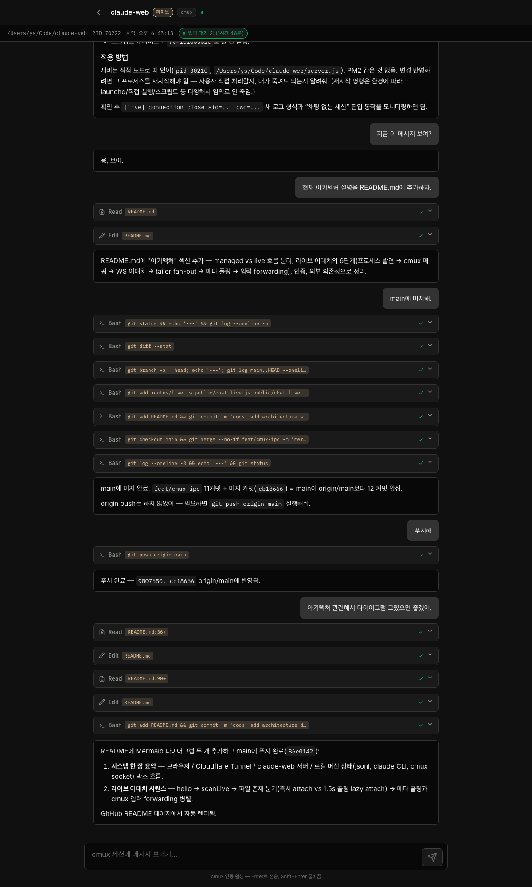
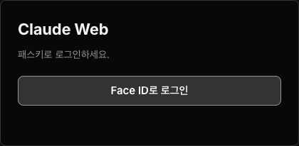

# work-on-the-moon (`wotm`)

**Languages:** [English](README.md) · [한국어](README-ko.md)

> Web launcher + live mirror for Claude Code sessions on **your own** machine.
> First-class support for **cmux-claude**: attach to your terminal/cmux Claude
> sessions from a phone or laptop browser.

```sh
npx work-on-the-moon
# → http://localhost:3700  (passkey setup link printed in stdout)
```



> Live view of a `cmux-claude` session — read-only by default, with optional
> keystroke forwarding through the cmux Unix socket.

---

## What it is

`wotm` is a small self-hosted Node server that does two things:

1. **Managed sessions (`/chat/<project>`)** — spawns `claude --dangerously-skip-permissions`
   inside `~/Code/<project>/` and exposes a chat UI to your browser. Bidirectional.
2. **Live sessions (`/chat-live/...`)** — **read-only mirror of any `claude` you
   already started elsewhere** (a terminal, **cmux-claude**, tmux, etc.) by tailing
   `~/.claude/projects/<encoded-cwd>/<sid>.jsonl`. If `cmux` is running, input is
   forwarded back through its Unix socket so you can type from a phone too.

The cmux-claude web access is the headline feature: you keep working in your
local cmux as usual, and `wotm` gives you a synchronized browser view + remote
keystroke injection.

## Requirements

- macOS (Linux/Windows planned — see Roadmap)
- Node.js 20+
- The `claude` CLI installed (autodetected at `~/.local/bin/claude`,
  `/usr/local/bin/claude`, `/opt/homebrew/bin/claude`, or `$CLAUDE_BIN`)
- A passkey-capable browser

## Quickstart (self-hosted)

```sh
npx work-on-the-moon            # listens on 127.0.0.1:3700
# open the printed /setup?token=... URL once to register a passkey
# subsequent visits just need the passkey
```



Reset everything (passkeys, sessions, tokens):

```sh
npx work-on-the-moon reset
```

## Why localhost + passkey?

WebAuthn (passkeys) requires a stable Relying Party ID. `wotm` defaults to
`RP_ID=localhost` and `ORIGIN=http://localhost:3700`, which the WebAuthn spec
treats as a secure context **without** TLS. This means:

- **Use `http://localhost:3700` in your browser** — not `127.0.0.1`, not your
  LAN IP. Passkeys will refuse to register otherwise.
- A passkey created against `localhost` is bound to your machine; it cannot be
  reused from another device against the same `localhost` URL.
- For multi-device access you need to expose the server under a real domain and
  set `ORIGIN`/`RP_ID` accordingly (e.g. via Cloudflare Tunnel, Tailscale Funnel,
  or your own reverse proxy). Changing `RP_ID` invalidates existing passkeys.

## Configuration

| Env var      | Default                  | Notes                                  |
|--------------|--------------------------|----------------------------------------|
| `PORT`       | `3700`                   | Listen port                            |
| `HOST`       | `127.0.0.1`              | Listen interface                       |
| `ORIGIN`     | `http://localhost:3700`  | WebAuthn expected origin               |
| `RP_ID`      | `localhost`              | WebAuthn Relying Party ID              |
| `CLAUDE_BIN` | autodetected             | Override path to the `claude` binary   |

State lives in `~/.claude-web/data.json` (passkeys, sessions, project history)
and is created on first run.

## Roadmap

`wotm` currently supports **macOS self-hosted** as its primary environment.
Planned additions:

- **Linux** support (PTY/path differences, packaging)
- **Tailscale Funnel** preset for multi-device access without Cloudflare
- **Docker** image for headless servers
- **Multi-user** mode (today the server assumes a single owner)
- More **cmux-claude** integration surfaces (workspace switching, surface
  metadata, attach-by-workspace)

Issues and PRs welcome.

---

## Architecture

```
auth/         WebAuthn, session cookie, JSON store
lib/          claude PTY runner, project store, live scanner, jsonl tailer, cmux IPC client
routes/       Express + WS — auth/setup/devices/projects/chat/slash/sessions/live
public/       Vanilla JS UI (chat, chat-live, index, login, setup, devices)
scripts/      smoke-* end-to-end checks
bin/          npx entry point (wotm)
```

### Two session flows

**Managed** — this server spawns and owns the `claude` CLI. Input over WS
(`/ws/chat`) → PTY → stdout JSONL → normalized → pushed back to the client.
Per-project state in `lib/projectStore.js`.

**Live** — this server **observes** an external `claude` process started
elsewhere (terminal, cmux, tmux). Process discovery via `pgrep`/`lsof`/`ps`,
session id extracted from the command line or recovered from the most recent
jsonl in `~/.claude/projects/<encoded-cwd>/`. The cmux Unix socket is probed
opportunistically — if present, input forwarding is enabled.

### Live attach flow

1. **Process discovery** (`lib/liveSessionScanner.js`)
   - `pgrep -fla` + `lsof -d cwd` + `ps -o lstart` to enumerate live PIDs.
   - Pull session id from `--session-id`/`--continue`/`--resume`, fall back to
     the most recent jsonl mtime within 60 s in the project dir.
   - Read jsonl head (4 KB) for cwd/gitBranch and tail (64 KB) for last
     user/assistant text. Memoized for 5 s.

2. **cmux mapping** (same scanner)
   - 1.5 s budget on the cmux unix socket: `listWorkspaces` → match cwd →
     `listSurfaces` to find the terminal surface id.
   - Decorate each entry with `cmuxAvailable / cmuxSurfaceId / cmuxWorkspaceId`.

3. **WS attach** (`routes/live.js` + `lib/liveTailer.js`)
   - Client sends `{type:'hello', sessionId}` or `{type:'hello', cwd}`.
   - Server resolves the jsonl path; if it doesn't exist yet (just-spawned
     session, no first message), it sends an empty transcript and polls every
     1.5 s until the file appears, then re-sends `init`.

4. **Tailer fan-out** (`lib/liveTailer.js`)
   - One fs watcher per file regardless of subscriber count. `fs.watch` + 1 s
     poll hybrid. New bytes parsed line-by-line and fanned out.

5. **Meta polling** (10 s)
   - `busy / idleSeconds / pid / cmuxAvailable` changes → `meta_update`.

6. **Input forwarding** (cmux entries only)
   - `{type:'send', text}` → `cmuxClient.sendText(surfaceId, text)` → keystroke
     injected into the external `claude` PTY via cmux IPC. Echo arrives via
     tail, so no optimistic render.

### Auth

- Single-user passkey (WebAuthn) registration.
- Session token in httpOnly cookie; WS accepts cookie or `?session=<token>`.
- 30-day session TTL. Atomic write + mutex on `~/.claude-web/data.json`.
- Bootstrap prints a one-time registration URL to stdout. `wotm reset` wipes
  all state.

### External dependencies

- `~/.claude/projects/<encoded-cwd>/<sessionId>.jsonl` — written by the
  `claude` CLI itself; this server only reads.
- cmux unix socket (`~/Library/Application Support/cmux/cmux.sock`) — optional,
  enables live input. Without it, live mode is read-only.

## License

MIT — see [LICENSE](LICENSE).
